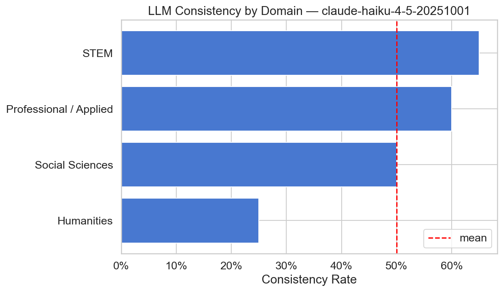
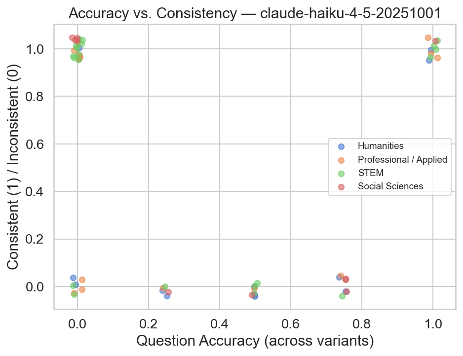
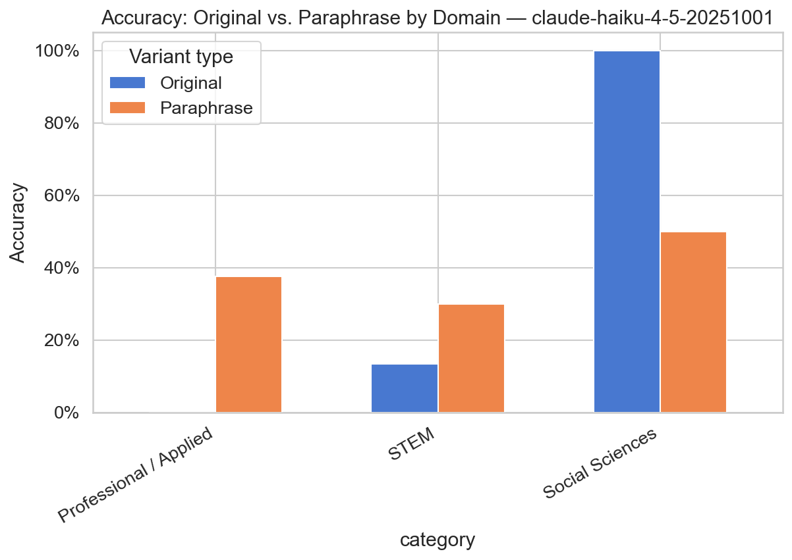
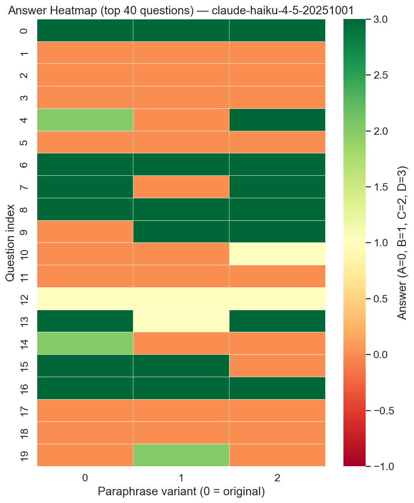
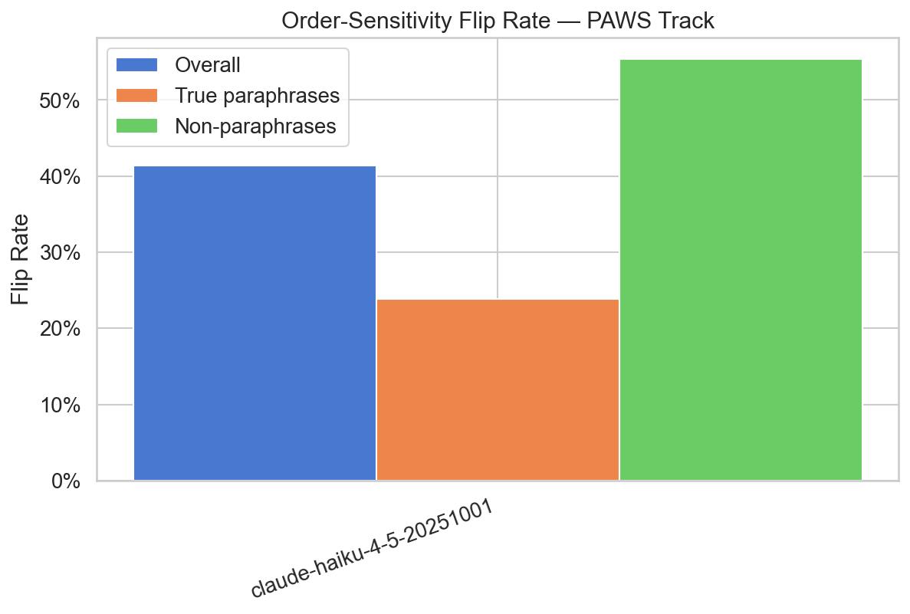
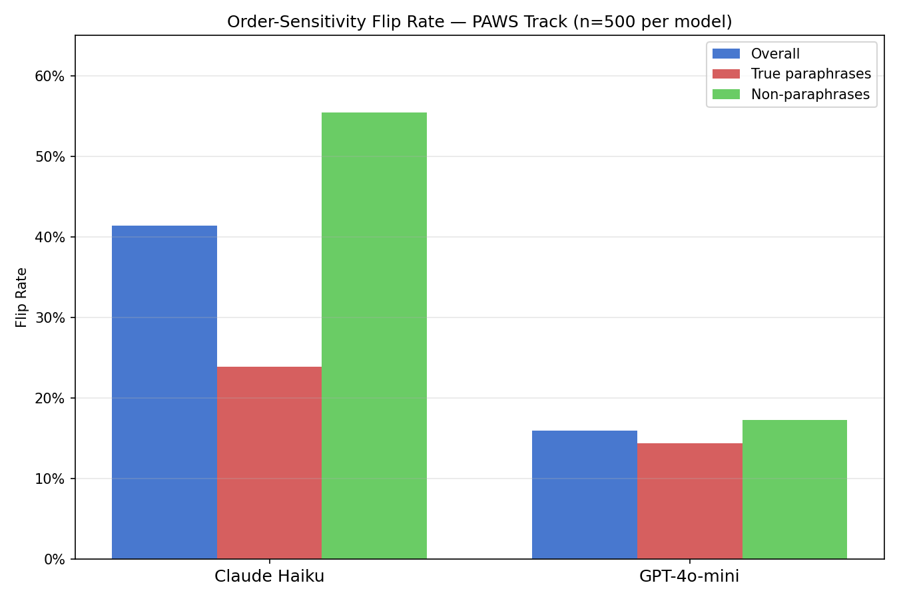
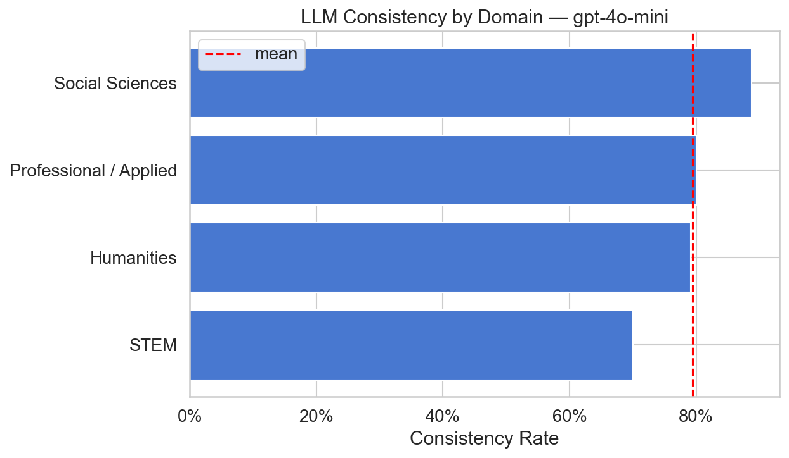
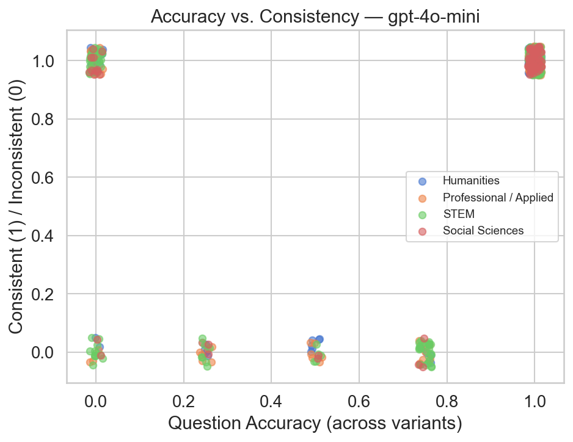
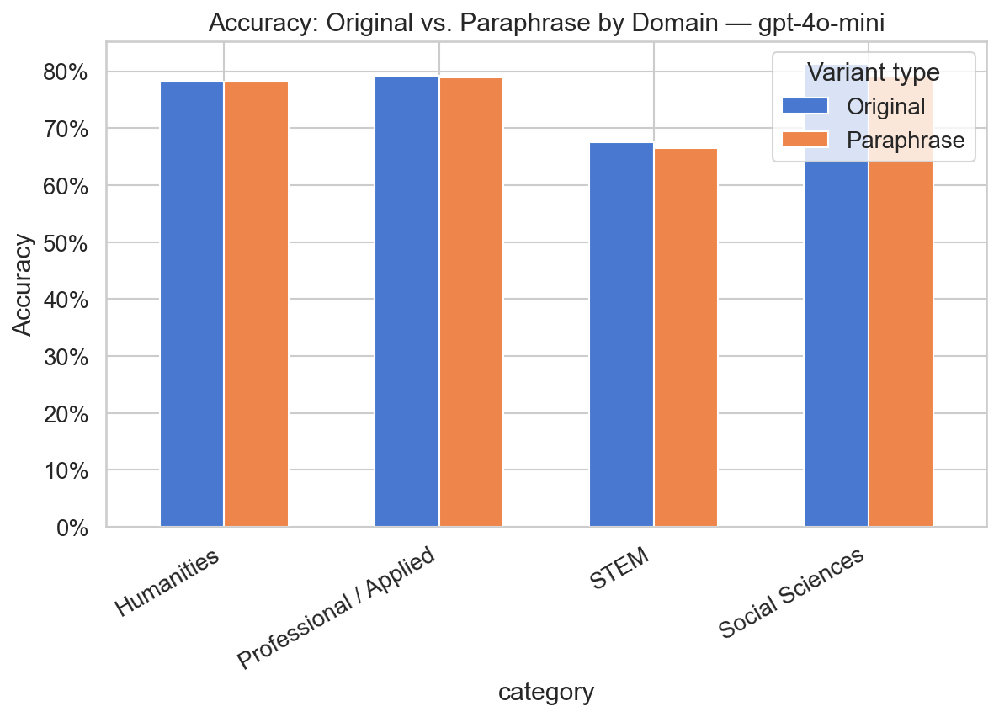
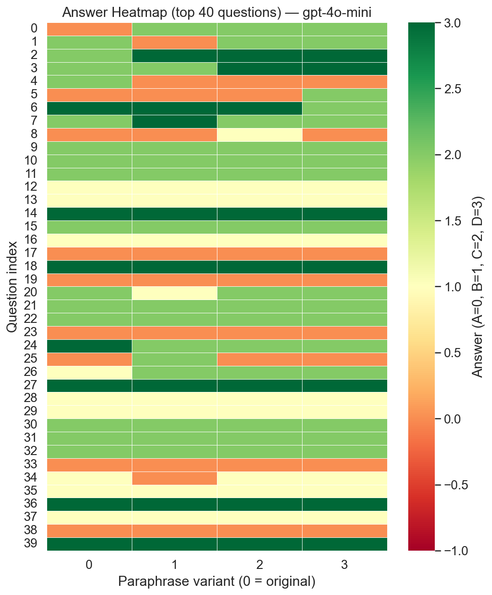

# LM Consistency Benchmark

> **Empirical Study of Paraphrase Sensitivity in Frontier Language Models**


---

## Introduction

A fundamental assumption underlying LLM evaluation and deployment is that semantically equivalent inputs produce equivalent outputs. If a model truly understands a question, rephrasing it should not change the answer. **This benchmark tests that assumption directly, empirically, and at scale.**

We introduce a two-track evaluation framework for measuring **paraphrase sensitivity** in frontier language models — the degree to which surface-level rephrasing or input reordering changes model behavior:

1. **Paraphrase Consistency (MMLU Track):** For each multiple-choice question, we generate semantically equivalent restatements using an auxiliary LLM and measure whether the target model answers identically across all variants.
2. **Order Sensitivity (PAWS Track):** Using adversarially constructed sentence pairs, we measure whether swapping the presentation order of a pair changes the model's paraphrase judgment.

Results reveal substantial and model-dependent sensitivity: Claude Haiku changes its answer on **~47% of paraphrased MMLU questions** (Krippendorff's α = 0.493, below reliability threshold), while GPT-4o-mini achieves **77.9% consistency** (α = 0.835, crossing the reliability threshold). On PAWS, Claude Haiku flips 41.4% of pairs vs. 16.0% for GPT-4o-mini — yet the two models show qualitatively different sensitivity profiles that reveal distinct reasoning behaviors.

### Why This Matters

- **Evaluation reliability:** If a model gives different answers to paraphrased versions of the same question, benchmark scores reflect prompt wording sensitivity, not true capability.
- **Production risk:** In applications where prompt phrasing is not tightly controlled, inconsistent behavior is an unpredictable and hard-to-debug failure mode.
- **Model comparison:** Consistency is a meaningful secondary signal — two models can achieve identical accuracy with very different consistency profiles, revealing different underlying reasoning stability.
- **AI safety / alignment:** A model that changes its answer based on surface form rather than semantics may be exploiting spurious statistical patterns rather than grounded understanding.

---

## Scope

### What This Benchmark Covers

| Dimension | Coverage |
|---|---|
| Benchmark datasets | MMLU (57 subjects, ~14K questions), PAWS (8K adversarial pair) |
| Paraphrase types | LLM-generated semantic restatements (MMLU), order-swapped input pairs (PAWS) |
| Models supported | Any Anthropic or OpenAI model via API |
| Metrics | Consistency rate, Krippendorff's α, accuracy drop, flip rate (stratified), accuracy–consistency correlation |
| Analysis | Domain-level breakdown, per-category variance, bootstrap 95% CIs |

### What This Benchmark Does NOT Cover

- **Adversarial robustness** — this study tests natural paraphrase variation, not malicious prompt attacks
- **Chain-of-thought / few-shot prompting** — all evaluations are zero-shot, single-turn only
- **Non-English benchmarks** — English only in the current version
- **Open-source / local models** — API-based models only (no HuggingFace inference)
- **Human-authored paraphrases** — paraphrases are LLM-generated; human validation is a planned extension

### Research Questions

1. **RQ1 — Consistency:** Do frontier LLMs produce the same answer when a question is semantically paraphrased? How does consistency vary across subject domains?
2. **RQ2 — Order sensitivity:** Do models exhibit position bias when sentence pairs are presented in reversed order?
3. **RQ3 — Accuracy–Consistency relationship:** Is inconsistency a proxy for question difficulty, or is it a distinct behavioral phenomenon?
4. **RQ4 — Model comparison:** Do Anthropic and OpenAI model families differ systematically in their paraphrase sensitivity profiles?

---

## Methodology

### Track 1 — PAWS (Order Sensitivity)

| Property | Detail |
|---|---|
| Dataset | [PAWS](https://huggingface.co/datasets/google-research-datasets/paws) `labeled_final` (8K test pairs) |
| Test | Each sentence pair evaluated in both orders: S1→S2 and S2→S1 |
| Stratification | True paraphrases (label=1) vs. adversarial non-paraphrases (label=0) |
| Key output | **Flip rate** — % of pairs where model contradicts itself across orderings |

### Track 2 — MMLU (Paraphrase Consistency)

| Property | Detail |
|---|---|
| Dataset | [MMLU](https://huggingface.co/datasets/cais/mmlu) (57 subjects, ~14K questions) |
| Test | Generate N paraphrases per question via LLM, query target model on each variant independently |
| Key outputs | **Consistency rate**, **Krippendorff's α**, **accuracy drop**, **accuracy–consistency correlation** |

### Evaluation Pipeline

```
Dataset (PAWS / MMLU)
        │
        ▼
Paraphrase Generation (LLM-based, cached to disk)
        │
        ▼
Model Query  ──────────────────────────────┐
(Anthropic / OpenAI API)                   │
        │                                  │
        ▼                                  ▼
  MMLU metrics                       PAWS metrics
  - consistency rate                 - flip rate
  - Krippendorff's α                 - stratified by label
  - accuracy drop                    - forward accuracy
  - accuracy–consistency corr
        │                                  │
        └──────────────┬───────────────────┘
                       ▼
          Bootstrap CIs + Figures + JSON Reports
```

### Design Choices

**Why PAWS?**
PAWS provides adversarially constructed near-paraphrase pairs — a stronger test than random paraphrases because it controls for word overlap. This separates models that reason about meaning from those relying on surface-level lexical cues.

**Why MMLU?**
MMLU has ground-truth labels across 57 distinct subject areas, enabling domain-stratified analysis. Its established accuracy baseline literature makes consistency findings interpretable alongside known model capability profiles.

**Why these metrics?**
- *Consistency Rate* — simple and interpretable, but ignores partial agreement
- *Krippendorff's α* — captures inter-variant reliability on a continuous scale; standard in annotation reliability literature
- *Flip Rate* — direct behavioral signal on PAWS, free of ground-truth dependence
- *Accuracy–Consistency Correlation* — tests whether inconsistency is a proxy for difficulty or a separate phenomenon

**Why LLM-generated paraphrases?**
Adversarial prompts test robustness to malicious inputs; paraphrases test consistency under natural restatement — a more realistic proxy for production prompt variation.

---

## Project Structure

```
lm-consistency-benchmark/
├── src/
│   ├── data_loader.py    # PAWS + MMLU loading via HuggingFace (no manual download)
│   ├── paraphrase.py     # LLM-based paraphrase generation with disk caching
│   ├── evaluate.py       # Model querying for both tracks (Anthropic + OpenAI)
│   ├── metrics.py        # Consistency rate, Krippendorff's α, flip rate, bootstrap CIs
│   └── visualize.py      # All plots → /figures
├── notebooks/
│   └── analysis.ipynb    # End-to-end results walkthrough
├── results/              # Cached model outputs + summary reports
├── figures/              # Generated plots
├── run_benchmark.py      # CLI entry point
└── requirements.txt
```

---

## Results

> **Sample sizes:** MMLU — 348 questions (Claude Haiku), 456 questions (GPT-4o-mini); 500 requested per model, some subjects failed to load due to schema incompatibility in the HuggingFace dataset version. PAWS — 500 pairs per model. All evaluations use temperature=0 (default). Bootstrap 95% CIs computed over 500 resamples.

### Model Comparison Summary

#### MMLU — Paraphrase Consistency

| Metric | Claude Haiku | GPT-4o-mini | Δ |
|---|---|---|---|
| **Consistency Rate** | **47.4%** (43.6–51.4%) | **77.9%** (75.1–81.0%) | +30.5pp |
| Accuracy | 30.3% (27.8–32.7%) | 74.6% (72.7–76.7%) | +44.3pp |
| Krippendorff's α | 0.493 (0.452–0.531) | **0.835** (0.813–0.860) | +0.342 |

#### PAWS — Order Sensitivity

| Metric | Claude Haiku | GPT-4o-mini | Δ |
|---|---|---|---|
| **Flip Rate (overall)** | **41.4%** (37.2–45.6%) | **16.0%** (13.0–19.4%) | −25.4pp |
| Flip Rate (true paraphrases) | 23.9% | 14.4% | −9.5pp |
| Flip Rate (non-paraphrases) | 55.4% | 17.3% | −38.1pp |
| Forward Accuracy | 60.0% | 78.6% | +18.6pp |

---

### Key Findings

**Finding 1 — Large consistency gap between models.**
GPT-4o-mini achieves 77.9% consistency vs. 47.4% for Claude Haiku on MMLU — a 30.5 percentage point gap. GPT-4o-mini's Krippendorff's α = 0.835 crosses the reliability threshold (α ≥ 0.8); Claude Haiku's α = 0.493 falls well below acceptable reliability.

**Finding 2 — PAWS reveals qualitatively different sensitivity profiles.**
Claude Haiku shows a **2.3× difference** in flip rate between true paraphrases (23.9%) and non-paraphrases (55.4%), indicating it picks up genuine semantic signal but remains highly order-sensitive. GPT-4o-mini shows nearly identical flip rates across both classes (14.4% vs 17.3%, **1.2× ratio**) — suggesting it is anchored to its initial classification regardless of pair type, not that it reasons about meaning more carefully.

**Finding 3 — Accuracy–Consistency are correlated but distinct.**
The Pearson correlation between per-question accuracy and consistency is r=0.40 (p<1e-18) for GPT-4o-mini — harder questions are less consistent, but the relationship is moderate, not deterministic. Inconsistency is not simply a proxy for difficulty.

**Finding 4 — Humanities is the most brittle domain for both models.**
Claude Haiku shows its lowest consistency in Humanities (~25–35%) despite its highest accuracy (~42–48%) in that domain — a confidence-without-stability pattern. GPT-4o-mini is more consistent across all domains but shows the smallest consistency advantage in STEM (70.0% vs ~50–65%).

---

### Detailed Results — Claude Haiku

**MMLU per-category:**

| Category | Consistency Rate | Accuracy | n |
|---|---|---|---|
| STEM | 53.8% | 28.1% | 160 |
| Humanities | 41.7% | 31.8% | 60 |
| Social Sciences | 33.9% | 33.0% | 56 |
| Professional / Applied | 48.6% | 31.9% | 72 |







**PAWS comparison across models:**



---

### Detailed Results — GPT-4o-mini

**MMLU per-category:**

| Category | Consistency Rate | Accuracy | n |
|---|---|---|---|
| STEM | 70.0% | 66.7% | 160 |
| Humanities | 79.2% | 78.1% | 96 |
| Social Sciences | 88.8% | 79.7% | 80 |
| Professional / Applied | 80.0% | 79.0% | 120 |






---

## Reproduce the Results

```bash
# 1. Install dependencies
pip install -r requirements.txt

# 2. Configure API keys
cp .env.example .env
# Edit .env — add ANTHROPIC_API_KEY and/or OPENAI_API_KEY

# 3. Reproduce the headline MMLU result (n=500, 3 paraphrases, temperature=0 default)
python run_benchmark.py --track mmlu --model claude-haiku-4-5-20251001 --n 500 --paraphrases 3

# 4. Reproduce the headline PAWS result (n=500)
python run_benchmark.py --track paws --model claude-haiku-4-5-20251001 --n 500

# 5. Run both tracks
python run_benchmark.py --track both --model claude-haiku-4-5-20251001

# 6. Run with an OpenAI model
python run_benchmark.py --track both --model gpt-4o-mini --provider openai --n 500
```

Outputs are saved to:
- `results/` — raw JSONL model outputs and summary JSON reports
- `figures/` — all plots (PNG)
- `results/paraphrases/` — cached paraphrase sets (reused across runs to save cost)

---

## Limitations

- **Sample size:** MMLU uses 348 questions (Claude Haiku) and 456 questions (GPT-4o-mini) with 3 paraphrases each; PAWS uses 500 pairs per model. Bootstrap CIs confirm headline findings are not noise artifacts, but domain-level breakdowns remain underpowered. Full-scale runs (n=1,000+) are planned.
- **Paraphrase quality:** Paraphrases are LLM-generated and may introduce lexical artifacts, subtle meaning shifts, or implicit answer leakage. Manual quality auditing is a planned validation step.
- **Model coverage:** Current results cover two models (`claude-haiku-4-5-20251001` and `gpt-4o-mini`) at default temperature. Findings should not be generalized until replicated across more providers and model sizes.
- **Prompt sensitivity:** The paraphrase generation prompt and model query prompt are not ablated. Different framings may shift the measured consistency rate.
- **No chain-of-thought:** All evaluations use zero-shot prompting. CoT prompting may improve or suppress consistency differently across models.

---

## Roadmap

- [x] Complete `gpt-4o-mini` comparison run and publish side-by-side results table
- [ ] Expand MMLU run to n=1,000+ questions
- [ ] Benchmark additional frontier models (Claude Sonnet, GPT-4o, Llama 3)
- [ ] Validate paraphrase label preservation via manual audit (10% sample)
- [ ] Add per-subject variance and distribution plots
- [ ] Add experiment config logging for full reproducibility
- [ ] Add unit tests for metrics module

---

## Metrics Reference

| Metric | Description |
|---|---|
| Consistency Rate | % of questions answered identically across all variants |
| Accuracy | % of answers correct on original questions |
| Krippendorff's α | Inter-rater reliability across variants (nominal scale; α ≥ 0.8 = reliable) |
| Flip Rate | % of PAWS pairs where answer changes with input order |
| Accuracy Drop | Accuracy(original) − Accuracy(paraphrases) |

---

## Citation

```bibtex
@misc{lm-consistency-benchmark,
  author       = {Junming Song},
  title        = {LM Consistency Benchmark: Empirical Study of Paraphrase Sensitivity in Frontier Language Models},
  year         = {2026},
  publisher    = {GitHub},
  url          = {https://github.com/jeffs1126/lm-consistency-benchmark}
}
```

---

## Datasets Used

- [PAWS](https://huggingface.co/datasets/google-research-datasets/paws) — Zhang et al., Google Research
- [MMLU](https://huggingface.co/datasets/cais/mmlu) — Hendrycks et al., CAIS

## License

MIT License. See [LICENSE](LICENSE) for details.
